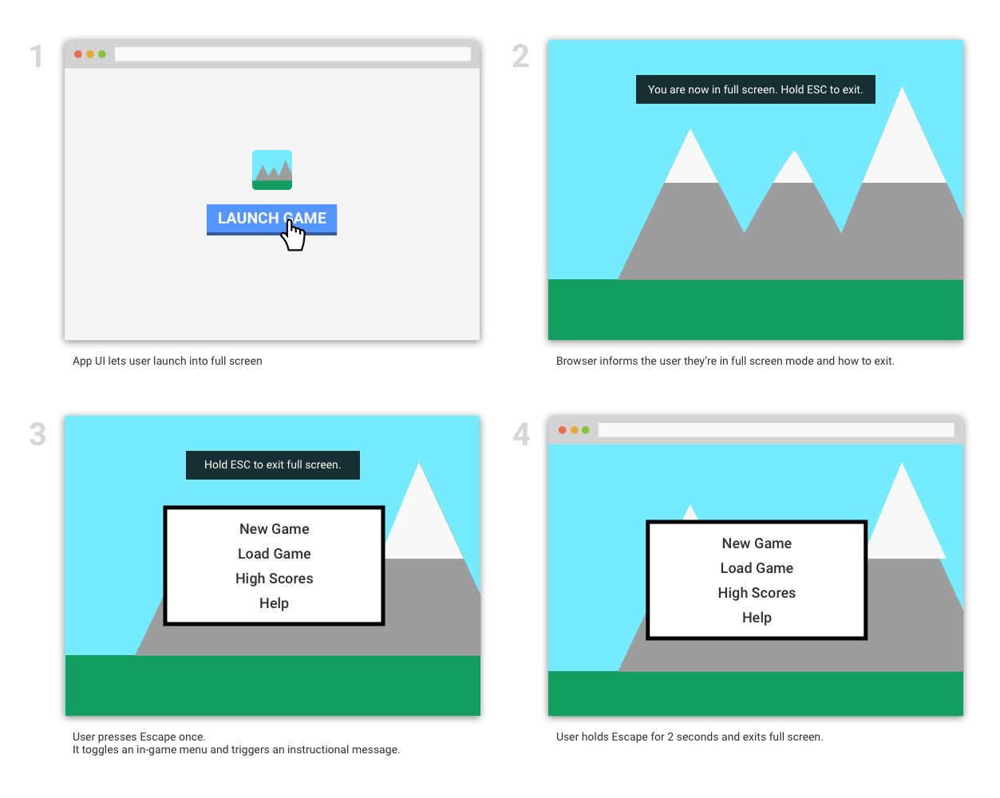

# System Keyboard Lock
API that allows websites to capture and use reserved keys and keyboard shortcuts.

## Problem
Richly interactive web sites, games and remote desktop/application streaming experiences want to provide an immersive, full screen experience. Sites need access to special keys and keyboard shortcuts in full screen, such as Escape, Alt+Tab, Cmd+`, Ctrl+N, for easily or efficiently navigating through windows, tabs, applications, menus and gaming functionality. Today this isn’t possible, as these keys are typically captured by the browser or underlying operating system, making it challenging for developers to embrace the web for these types of applications. This repo explores ideas for a new system keyboard lock API, that enable websites to capture and use all available keys and keyboard combinations allowed by the OS.

## Use Cases 
1. A developer is working from home and wants to remote into their development PC at work. The user opens a web-based remote    desktop application to connect to the remote device. All the browser and OS shortcuts, such as Cmd/Alt+Tab                   should be used to switch windows on the remote computer, while Escape can be used to cancel a command. 
2. A user is playing Call of Duty over a streaming game service. In the game, the Escape key can be used to access the menu.
3. A user is playing a rich, web-based immersive game in full screen. The user is able to navigate through the game using       their keyboard and is able to launch and exit menus using the Escape key and use Alt/Cmd+Tab without exiting the browser     or full screen.
 
## Proposal
When a site is in full screen, it will be permitted to request a system keyboard lock allowing it to override all keys as well as system-level shortcuts. Users exit the keyboard lock through an exit gesture, such as holding down the Escape key for 2 seconds.

## Requirements
* System keyboard lock is only available when the document is in [fullscreen mode](https://fullscreen.spec.whatwg.org/#fullscreen-enabled-flag), and only from a secure origin.
* Browsers should optionally add permission, consent or reminder UI to ensure users understand how to exit system keyboard lock mode.
* If the user holds the Escape key for 2 seconds, both system keyboard lock and fullscreen should be exited. This shortcut cannot be captured by the site.
* Once system keyboard lock is granted, the browser will disable the typical behavior of specified system keys and shortcuts, and make them available to the web site. Keys and shortcuts which may be accessed in system keyboard lock include:
  * Escape
  * Super (e.g., Windows key, ChromeOS search key)
  * Alt/Cmd+Tab
  * Alt+F4
  * Alt+Backtick
  * PrtScn

## Sample Code
__Requesting keyboard lock__
```javascript
document.body.requestFullscreen().then(
    () => {
      const keys = [
        { code: 'Escape' },
        { code: 'Tab', altKey: true },
        { code: 'Tab', metaKey: true },
      ];
      navigator.requestSystemKeyboardLock(keys);
    });
document.addEventListener(‘keydown’, event => {
  if (event.code == 'Escape') {
    game.toggleMenu();
  }
}, false);
```

In the above example, the Escape key is intercepted because it is used to toggle the in-game menu; because this key is intercepted, its usual function (exit full-screen) is suppressed. The default behavior of the Alt+Tab and Meta (a.k.a. Cmd)+Tab keyboard shortcuts (task switch on Windows and Mac, respectively) are also suppressed, although the event handler does not provide alternative functionality in this case. Note that modifiers that are not specified explicitly are wild-cards; specifically, this configuration also suppresses the default behavior of Shift+Alt+Tab and Shift+Meta+Tab (reverse task switch on Windows and Mac, respectively).

Requested keys must be declared in advance, rather than being implicit based on whether or not `preventDefault()` is called by the event handler. This is because the platform-specific event handlers for system keys typically have to decide whether or not to suppress the default behaviour. If this depends on whether or not the JavaScript calls `preventDefault()` this may not be possible.

__User experience__

1. Enter full-screen mode via some UI provided by the web-page.
2. Press the Escape key.
3. See the in-game menu open/close; the web-page remains full-screen.

__Monitoring keyboard lock__
```javascript
document.addEventListener(‘systemkeyboardlockchanged’, event => {
  if (event.systemKeyboardLockEnabled) {
    console.log(‘System keyboard lock enabled.’);
  } else {
    console.log(‘System keyboard lock disabled.’);
  }
}, false);
```

## Sample User Experience Flow


